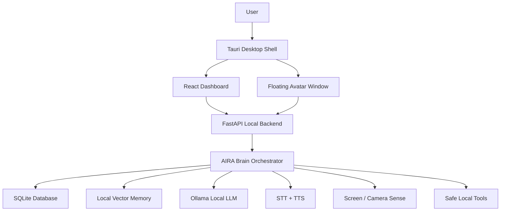
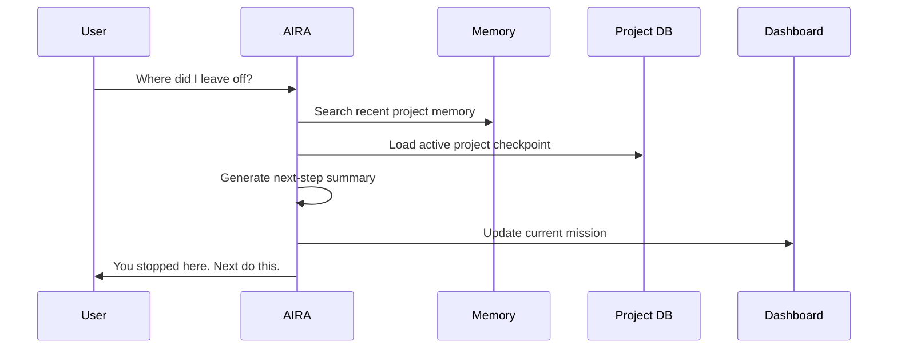
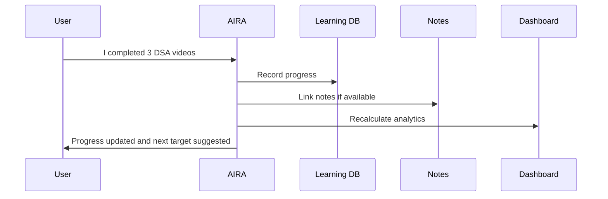
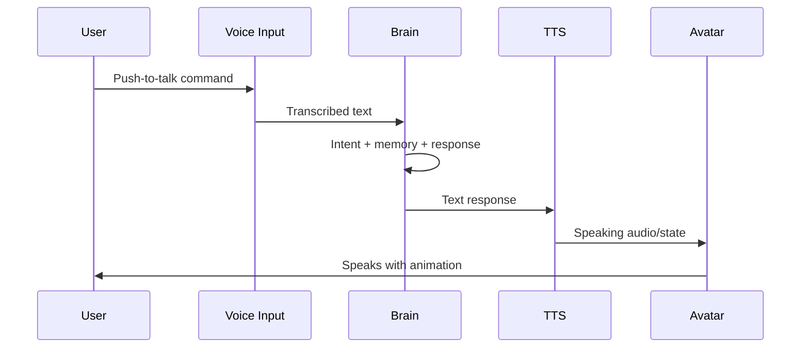
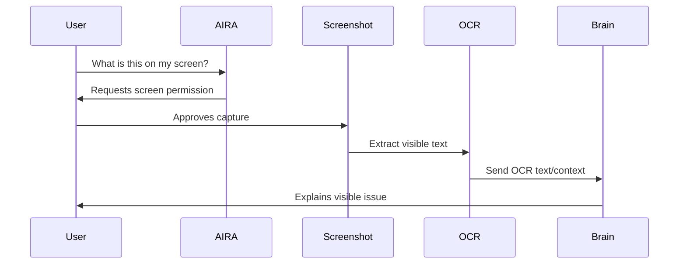
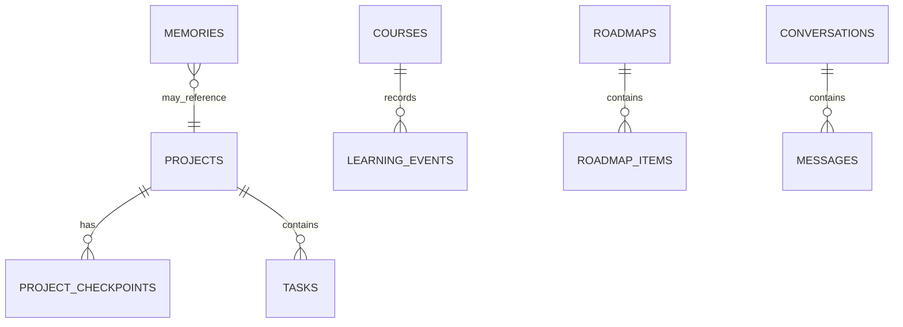

# AIRA MVP Implementation Roadmap and Architecture PRD

Version: 1.0  
Project: AIRA — Local-First Desktop AI Companion  
Document Type: MVP Architecture + Implementation Roadmap PRD  
Target Device: ASUS TUF A15, AMD Ryzen 7 7445HS, 16 GB RAM, RTX 3050 Laptop GPU 4 GB VRAM  
Cost Philosophy: Near-zero rupees, local-first, optional cloud fallback only  
Status: Final V1 Planning Lock

---

## 1. Purpose of This Document

This document turns the AIRA vision into a practical V1 build plan.

The earlier documents locked:

1. Product vision and features.
2. UI/UX and avatar direction.
3. Technical stack.

This document locks:

1. MVP architecture.
2. Build order.
3. Module responsibilities.
4. Development phases.
5. V1 acceptance criteria.
6. What must be avoided in V1.
7. The exact path from idea to first working assistant.

After this document, the project is ready to move from planning into actual development.

---

## 2. Final V1 Product Goal

AIRA V1 must become a usable local desktop companion that can:

- open as a desktop app;
- show a futuristic dashboard;
- chat locally using a small local LLM;
- remember projects and checkpoints;
- answer “where did I leave off?”;
- track learning/course/placement progress;
- speak using local TTS;
- listen through push-to-talk;
- appear as a lightweight desktop avatar when summoned;
- analyze the screen only on demand using screenshot + OCR;
- run without paid APIs for core use.

AIRA V1 should not try to become movie-level Jarvis. It should become the strongest realistic first version: a personal, memory-based, voice-enabled desktop study/work companion.

---

## 3. V1 Success Definition

AIRA V1 is successful if the user can use it daily for:

1. Project continuation.
2. Placement preparation tracking.
3. Course progress analytics.
4. Voice-based quick interaction.
5. Dashboard-based self-monitoring.
6. On-demand screen explanation.
7. A desktop avatar that feels present but does not slow the laptop.

The main emotional success:

> The user should feel: “This assistant knows my work, remembers my progress, and helps me continue.”

The main technical success:

> The app should run locally, reliably, and cheaply on the ASUS TUF A15 laptop.

---

## 4. MVP Scope Lock

### 4.1 Must Build in V1

| Area | V1 Requirement |
| --- | --- |
| Desktop app | Tauri Windows desktop app |
| Dashboard | React command center dashboard |
| Local backend | FastAPI service running on localhost |
| Database | SQLite local database |
| Chat | Local LLM chat via Ollama |
| Memory | Project, learning, preference, and checkpoint memory |
| Projects | Add project, update status, save checkpoint, resume project |
| Learning | Course tracker, notes tracker, roadmap tracker |
| Analytics | Completion %, remaining work, daily mission, streaks |
| Voice input | Push-to-talk transcription |
| Voice output | Local female TTS |
| Avatar | Floating desktop companion with states |
| Screen sense | On-demand screenshot + OCR |
| Settings | Model, privacy, voice, avatar, local-only mode |

### 4.2 Should Build if Time Allows

| Area | V1.1 Candidate |
| --- | --- |
| Wake word | “Hey AIRA” through openWakeWord |
| Browser extension | YouTube progress tracking |
| Better avatar | Rive/Live2D upgrade |
| Region screen capture | User selects part of screen |
| Flashcards | Generate revision cards from notes |
| Export | Weekly study/project report |

### 4.3 Must Not Build in V1

| Not in V1 | Reason |
| --- | --- |
| Continuous screen vision | Too heavy and privacy-risky |
| Continuous webcam analysis | Not needed and risky |
| Advanced emotion recognition | Not reliable locally |
| Many models running together | Bad for 4 GB VRAM |
| Full autonomous computer control | Too risky before safe tool system |
| Paid API dependency | Breaks near-zero-cost goal |
| Mobile app | Adds too much scope |
| Cloud sync | Adds security and cost complexity |

---

## 5. Final Recommended Architecture

### 5.1 High-Level Architecture



### 5.2 Runtime Architecture

At runtime, AIRA should run as three main processes/components:

| Component | Runtime | Responsibility |
| --- | --- | --- |
| Desktop shell | Tauri/Rust | Native windows, tray, hotkeys, permissions |
| Frontend UI | React/TypeScript | Dashboard, chat, settings, avatar UI |
| Local backend | Python/FastAPI | AI orchestration, data, memory, voice, tools |

Optional external local processes:

- Ollama server;
- whisper.cpp/faster-whisper process;
- Piper TTS binary;
- Tesseract OCR binary.

### 5.3 Why This Architecture Is Correct for V1

This architecture is chosen because:

- Tauri keeps desktop resource usage lower than Electron.
- React is fast for building dashboard UI.
- Python is best for AI, voice, OCR, and local tooling.
- SQLite is enough for a personal assistant.
- Ollama makes local model setup easier.
- Each feature can be built step by step.
- Paid APIs are not required.
- Heavy modules can be lazy-loaded only when needed.

---

## 6. Core User Loops

### 6.1 Project Continuation Loop



### 6.2 Learning Tracker Loop



### 6.3 Voice Interaction Loop



### 6.4 Screen Sense Loop



---

## 7. Module Architecture

### 7.1 Desktop Shell Module

Purpose:

Native desktop behavior and process control.

Responsibilities:

- launch app;
- open dashboard window;
- open transparent avatar window;
- manage tray icon;
- manage global hotkey;
- start/stop local backend;
- request microphone permission;
- request screen permission;
- request camera permission if enabled;
- manage always-on-top avatar;
- support auto-start setting.

V1 acceptance:

- user can launch app;
- dashboard opens;
- avatar can be shown/hidden;
- backend starts automatically;
- app closes cleanly.

### 7.2 Dashboard Module

Purpose:

Main command center for AIRA.

Screens:

- Home;
- Today;
- Projects;
- Learning;
- Roadmap;
- Insights;
- Memory;
- Chat;
- Settings.

V1 acceptance:

- all core screens exist;
- dashboard data comes from backend;
- user can create project;
- user can create course;
- analytics cards update;
- user can manage basic settings.

### 7.3 Avatar Module

Purpose:

Make AIRA feel present on the desktop.

MVP implementation:

- sprite or simple animated character;
- transparent floating window;
- docked position;
- click to open quick panel;
- states controlled by backend.

Required states:

- sleeping;
- idle;
- listening;
- thinking;
- speaking;
- working;
- success;
- warning;
- privacy.

V1 acceptance:

- avatar appears when summoned;
- avatar changes state during chat/voice;
- avatar does not block normal work;
- avatar can be hidden.

### 7.4 Brain Orchestrator Module

Purpose:

The central decision engine.

Responsibilities:

- understand intent;
- decide if memory is needed;
- call local LLM;
- call tools safely;
- update avatar state;
- generate final response;
- save useful memory/checkpoints.

Core intent categories:

- general question;
- project continuation;
- save checkpoint;
- learning update;
- roadmap planning;
- dashboard query;
- screen explanation;
- voice command;
- settings command;
- casual companion chat.

V1 acceptance:

- AIRA routes at least the above intents reliably;
- AIRA does not call screen/camera tools unless requested;
- AIRA can answer project and learning questions from stored data.

### 7.5 Memory Module

Purpose:

Store and retrieve important personal context.

Memory types:

- profile preferences;
- project memory;
- learning memory;
- roadmap memory;
- conversation summaries;
- assistant settings.

V1 acceptance:

- user can save memory;
- user can view memory;
- user can delete memory;
- “where did I leave off?” works;
- project checkpoint retrieval works.

### 7.6 Local LLM Module

Purpose:

Generate responses using free local models.

V1 runtime:

- Ollama;
- Qwen2.5 3B or Llama 3.2 3B;
- optional Qwen2.5 7B Q4 for stronger responses.

V1 acceptance:

- user can select model;
- app detects if Ollama/model is unavailable;
- app shows setup guidance;
- responses stream into chat UI;
- app does not crash if model fails.

### 7.7 Voice Module

Purpose:

Allow the user to talk with AIRA.

V1 scope:

- push-to-talk;
- speech-to-text;
- text-to-speech;
- stop speaking;
- transcript preview.

Recommended:

- Whisper base/tiny;
- Piper female voice.

V1 acceptance:

- user can press button/hotkey and speak;
- speech becomes text;
- AIRA responds;
- AIRA speaks response;
- user can interrupt speech.

### 7.8 Learning Module

Purpose:

Track courses, notes, roadmap, and placement preparation.

V1 features:

- add course;
- add total videos;
- mark videos watched;
- record notes count;
- record study session;
- create placement roadmap;
- mark topics complete;
- show progress analytics.

V1 acceptance:

- user can track a course manually;
- dashboard shows completion;
- AIRA can suggest next study task;
- AIRA can answer “how much is left?”

### 7.9 Screen Sense Module

Purpose:

Allow on-demand screen help.

V1 method:

- screenshot capture;
- OCR extraction;
- local LLM explanation based on extracted text;
- privacy indicator.

V1 acceptance:

- user asks AIRA to look;
- permission/confirmation is shown;
- screenshot is captured;
- OCR text is extracted;
- AIRA explains visible text/error;
- raw screenshot is not saved by default.

### 7.10 Settings and Privacy Module

Purpose:

Give the user control.

Required settings:

- local-only mode;
- model selection;
- voice selection;
- push-to-talk key;
- avatar visibility;
- memory on/off;
- screen access confirmation;
- camera disabled/enabled;
- data export;
- clear memory.

V1 acceptance:

- user can control privacy and memory;
- screen/camera are off by default;
- cloud fallback is off by default.

---

## 8. Data Architecture

### 8.1 Local Storage

All core V1 data should live locally.

Recommended app data path on Windows:

```text
%LOCALAPPDATA%/AIRA/
```

Suggested structure:

```text
AIRA/
  aira.sqlite
  vector/
  logs/
  cache/
  voices/
  exports/
  avatar/
  settings.json
```

### 8.2 Database Tables for V1

Minimum required tables:

```text
settings
conversations
messages
memories
projects
project_checkpoints
tasks
courses
course_progress
notes
roadmaps
roadmap_items
learning_events
analytics_snapshots
avatar_events
tool_runs
privacy_events
```

### 8.3 Entity Relationship Overview



### 8.4 V1 Data Rules

Rules:

- project checkpoints must always have timestamps;
- learning progress must be manually correctable;
- memories must be visible to the user;
- raw screenshots must be temporary by default;
- voice recordings must not be stored by default;
- app logs must avoid private content where possible.

---

## 9. API Architecture

### 9.1 Local API Principle

The backend API must run only on localhost by default:

```text
http://127.0.0.1:<port>
```

No public server is required for V1.

### 9.2 Required API Groups

| API Group | Purpose |
| --- | --- |
| Health | app/backend status |
| Chat | local assistant chat |
| Memory | save/search/delete memory |
| Projects | project and checkpoint management |
| Learning | course, notes, roadmap progress |
| Analytics | dashboard metrics |
| Voice | STT and TTS operations |
| Screen | on-demand screenshot/OCR |
| Avatar | avatar state events |
| Settings | privacy/model/voice/avatar settings |

### 9.3 Required V1 Endpoints

```text
GET    /api/health
POST   /api/chat
GET    /api/conversations
GET    /api/conversations/{id}

GET    /api/projects
POST   /api/projects
PATCH  /api/projects/{id}
POST   /api/projects/{id}/checkpoint
GET    /api/projects/{id}/last-checkpoint

GET    /api/learning/courses
POST   /api/learning/courses
PATCH  /api/learning/courses/{id}
POST   /api/learning/events
GET    /api/learning/summary

GET    /api/roadmap
POST   /api/roadmap/items
PATCH  /api/roadmap/items/{id}

GET    /api/memory
POST   /api/memory
POST   /api/memory/search
DELETE /api/memory/{id}

GET    /api/analytics/dashboard
POST   /api/voice/transcribe
POST   /api/voice/speak
POST   /api/screen/analyze
GET    /api/avatar/state
POST   /api/avatar/state
GET    /api/settings
PATCH  /api/settings
```

### 9.4 WebSocket Channels

```text
/ws/chat
/ws/avatar
/ws/voice
/ws/system
```

Use WebSockets for:

- streaming chat tokens;
- avatar state changes;
- voice listening/speaking status;
- backend progress events.

---

## 10. Repository Structure

### 10.1 Recommended Monorepo

```text
aira/
  apps/
    desktop/
      src/
      src-tauri/
      package.json
    backend/
      app/
      tests/
      pyproject.toml
    extension/
      src/
      manifest.json
  packages/
    shared-types/
    ui/
  docs/
    prd/
    architecture/
    api/
  scripts/
  models/
    README.md
  README.md
```

### 10.2 Why Monorepo

A monorepo is recommended because:

- desktop, backend, extension, and shared types stay together;
- easier development during MVP;
- easier versioning;
- easier documentation;
- one project folder contains the full system.

### 10.3 First Actual Repo Setup

Recommended first setup:

```text
apps/desktop    -> Tauri + React
apps/backend    -> FastAPI
docs/prd        -> locked PRDs
```

Do not start with the browser extension. Add it after the core assistant works.

---

## 11. Build Order

### 11.1 Correct Build Order

Build AIRA in this order:

1. Local backend foundation.
2. Desktop shell.
3. Dashboard shell.
4. Local chat.
5. Project checkpoint memory.
6. Learning tracker.
7. Analytics dashboard.
8. Voice input/output.
9. Avatar window.
10. Screen sense.
11. Polish and packaging.

### 11.2 Why This Order

The assistant becomes useful through memory and continuity first. The avatar should come after the assistant can actually help. If the build starts with a fancy avatar but weak memory, AIRA will feel like decoration. If the build starts with project memory and dashboard, the avatar later feels alive because it represents a useful brain.

---

## 12. MVP Milestones

### Milestone 0 — Project Setup

Goal:

Create the project foundation.

Deliverables:

- monorepo initialized;
- Tauri desktop app created;
- React + TypeScript running;
- FastAPI backend running;
- SQLite connected;
- basic README;
- environment setup notes.

Acceptance:

- `desktop dev` opens window;
- `backend dev` starts API;
- `/api/health` returns success;
- desktop can call backend health endpoint.

Estimated difficulty:

Medium.

### Milestone 1 — Local Chat MVP

Goal:

Make AIRA answer using a local model.

Deliverables:

- Ollama integration;
- model setup screen;
- chat UI;
- streaming response;
- basic personality prompt;
- local-only indicator.

Acceptance:

- user types message;
- local model responds;
- response streams;
- model unavailable error is handled;
- chat history saves locally.

Estimated difficulty:

Medium.

### Milestone 2 — Project Memory and Checkpoints

Goal:

Make AIRA remember work progress.

Deliverables:

- project CRUD;
- project dashboard cards;
- save checkpoint command;
- last checkpoint retrieval;
- “where did I leave off?” flow;
- memory screen.

Acceptance:

- user creates a project;
- user saves checkpoint;
- user closes/reopens app;
- AIRA recalls last checkpoint;
- dashboard shows next action.

Estimated difficulty:

Medium-high.

### Milestone 3 — Learning and Placement Tracker

Goal:

Track course and placement preparation progress.

Deliverables:

- course tracker;
- video progress fields;
- notes count;
- roadmap items;
- manual progress update;
- analytics calculations.

Acceptance:

- user adds a course;
- user marks videos watched;
- user updates notes;
- dashboard shows progress percentage;
- AIRA recommends next study task.

Estimated difficulty:

Medium.

### Milestone 4 — Dashboard Command Center

Goal:

Make the full dashboard feel like the AIRA command center.

Deliverables:

- Home;
- Today;
- Projects;
- Learning;
- Roadmap;
- Insights;
- Memory;
- Settings.

Acceptance:

- user can navigate all pages;
- all pages show real local data;
- dashboard has futuristic AIRA theme;
- empty states are helpful;
- core actions work from dashboard.

Estimated difficulty:

Medium-high.

### Milestone 5 — Voice MVP

Goal:

Talk with AIRA.

Deliverables:

- push-to-talk;
- speech transcription;
- TTS response;
- voice settings;
- stop speaking;
- transcript display.

Acceptance:

- user speaks;
- AIRA converts speech to text;
- AIRA responds;
- AIRA speaks response;
- user can interrupt.

Estimated difficulty:

High.

### Milestone 6 — Desktop Avatar MVP

Goal:

Make AIRA live on the desktop.

Deliverables:

- transparent avatar window;
- show/hide/summon;
- avatar dock position;
- state animations;
- quick action panel;
- dashboard open command.

Acceptance:

- avatar appears when called;
- avatar changes when listening/thinking/speaking;
- avatar can be hidden;
- avatar does not consume heavy resources.

Estimated difficulty:

Medium-high.

### Milestone 7 — On-Demand Screen Sense

Goal:

Allow AIRA to answer “what is this?” from screen.

Deliverables:

- screenshot permission flow;
- screenshot capture;
- OCR;
- explanation prompt;
- temporary screenshot deletion;
- privacy indicator.

Acceptance:

- user asks screen question;
- user approves;
- AIRA reads visible text;
- AIRA gives useful explanation;
- no continuous screen watching happens.

Estimated difficulty:

High.

### Milestone 8 — V1 Packaging and Polish

Goal:

Make V1 installable and usable.

Deliverables:

- Windows installer;
- first-run onboarding;
- model setup guide;
- privacy setup;
- default settings;
- error handling;
- performance mode;
- export/backup option.

Acceptance:

- fresh install works;
- user can complete onboarding;
- app runs without paid services;
- V1 checklist passes.

Estimated difficulty:

Medium-high.

---

## 13. Sprint Plan

### Sprint 1 — Foundation

Duration:

1 week.

Tasks:

- create monorepo;
- create Tauri app;
- create FastAPI app;
- connect frontend to backend;
- create SQLite database;
- create settings table;
- create health check;
- create basic dashboard shell.

Output:

Working desktop app with backend connection.

### Sprint 2 — Chat

Duration:

1 week.

Tasks:

- integrate Ollama;
- add model config;
- build chat UI;
- stream responses;
- save conversations/messages;
- add basic AIRA system prompt;
- handle model missing error.

Output:

User can chat with AIRA locally.

### Sprint 3 — Projects and Memory

Duration:

1–2 weeks.

Tasks:

- create project tables;
- create project UI;
- create checkpoint API;
- create memory table;
- implement “save checkpoint”;
- implement “where did I leave off?”;
- create Memory page.

Output:

AIRA remembers and resumes project work.

### Sprint 4 — Learning Tracker

Duration:

1–2 weeks.

Tasks:

- create course tables;
- create learning events;
- create roadmap tables;
- create course UI;
- create roadmap UI;
- add manual progress updates;
- add analytics summary.

Output:

AIRA tracks courses and placement preparation.

### Sprint 5 — Dashboard Polish

Duration:

1 week.

Tasks:

- create Today page;
- create Insights page;
- add charts;
- add progress cards;
- add daily mission;
- add empty states;
- improve visual theme.

Output:

Dashboard feels like command center.

### Sprint 6 — Voice

Duration:

1–2 weeks.

Tasks:

- integrate Whisper;
- integrate Piper;
- add push-to-talk UI;
- add voice state events;
- add speaking playback;
- add stop/interrupt;
- add voice settings.

Output:

User can talk with AIRA.

### Sprint 7 — Avatar

Duration:

1–2 weeks.

Tasks:

- create transparent avatar window;
- add simple avatar art/sprite;
- add avatar states;
- connect avatar to backend events;
- add summon/hide;
- add quick panel.

Output:

AIRA lives on desktop.

### Sprint 8 — Screen Sense

Duration:

1 week.

Tasks:

- implement screenshot capture;
- add permission confirmation;
- integrate OCR;
- send OCR to brain;
- add privacy indicator;
- auto-delete temporary capture.

Output:

AIRA can explain visible screen text/errors on demand.

### Sprint 9 — Packaging and V1 QA

Duration:

1 week.

Tasks:

- create installer;
- onboarding;
- model setup flow;
- settings defaults;
- performance mode;
- error testing;
- V1 acceptance checklist.

Output:

AIRA V1 ready for daily use.

---

## 14. Estimated Timeline

Realistic solo build estimate:

| Build Style | Timeline |
| --- | --- |
| Fast prototype | 4–6 weeks |
| Usable MVP | 8–12 weeks |
| Polished V1 | 3–5 months |
| Strong personal daily assistant | 6+ months |

Given the scope, the honest expectation:

> A usable AIRA MVP can be built in 2–3 months if development is consistent. A polished “feels alive” V1 will likely take 3–5 months.

---

## 15. Technical Setup Checklist

### 15.1 Required Software

Install:

- Node.js LTS;
- pnpm;
- Python 3.11+;
- uv or Poetry;
- Rust;
- Tauri prerequisites;
- Ollama;
- Git;
- VS Code;
- SQLite viewer;
- Tesseract OCR;
- Piper TTS;
- Whisper.cpp or faster-whisper.

### 15.2 Recommended Models

Install through Ollama:

```text
qwen2.5:3b
llama3.2:3b
nomic-embed-text
```

Optional:

```text
qwen2.5:7b-instruct-q4
phi3.5:mini
```

Avoid for V1 on this laptop:

```text
13B+ models
multiple loaded models
heavy VLM as default
```

---

## 16. V1 Feature Breakdown

### 16.1 Chat Feature

User stories:

- As a user, I can chat with AIRA locally.
- As a user, I can see when AIRA is thinking.
- As a user, I can switch local models.
- As a user, I can continue earlier conversation.

Acceptance:

- chat input works;
- streamed output works;
- conversation saved;
- model errors handled;
- local-only mode displayed.

### 16.2 Project Feature

User stories:

- As a user, I can create a project.
- As a user, I can save a checkpoint.
- As a user, I can ask where I left off.
- As a user, I can see next task.

Acceptance:

- projects persist;
- checkpoints persist;
- resume answer uses latest checkpoint;
- dashboard shows active project.

### 16.3 Learning Feature

User stories:

- As a user, I can add a course.
- As a user, I can update watched videos.
- As a user, I can track notes.
- As a user, I can view progress analytics.
- As a user, I can follow a placement roadmap.

Acceptance:

- course progress saved;
- completion calculated correctly;
- notes count shown;
- roadmap items can be completed;
- AIRA suggests next study action.

### 16.4 Voice Feature

User stories:

- As a user, I can press a key and talk.
- As a user, I can hear AIRA reply.
- As a user, I can stop AIRA speaking.

Acceptance:

- push-to-talk works;
- transcription works;
- TTS works;
- avatar state changes during voice.

### 16.5 Avatar Feature

User stories:

- As a user, I can summon AIRA.
- As a user, I can hide AIRA.
- As a user, I can see AIRA listening/thinking/speaking.
- As a user, I can open dashboard from avatar.

Acceptance:

- transparent window works;
- state animations work;
- no heavy idle resource usage;
- quick actions work.

### 16.6 Screen Sense Feature

User stories:

- As a user, I can ask “what is this?”
- As a user, I can approve screen capture.
- As a user, I can get explanation of visible error/text.

Acceptance:

- explicit approval required;
- screenshot captured;
- OCR result extracted;
- AIRA explains;
- screenshot removed unless saved.

---

## 17. Prompt and Personality Architecture

### 17.1 AIRA System Personality

AIRA should speak like:

- calm;
- intelligent;
- slightly warm;
- not robotic;
- not overly emotional;
- supportive;
- direct when needed;
- privacy-aware.

### 17.2 Core Prompt Layers

Use layered prompts:

1. System identity.
2. Safety/privacy rules.
3. Current mode.
4. User profile memory.
5. Relevant project/learning memory.
6. Current user request.
7. Tool outputs if any.

### 17.3 Prompt Routing

Different tasks should use different prompt templates:

| Task | Template |
| --- | --- |
| General chat | Companion chat prompt |
| Project resume | Project continuation prompt |
| Learning analytics | Study coach prompt |
| Screen explanation | OCR/screen helper prompt |
| Checkpoint save | Structured summarizer prompt |
| Dashboard insight | Analytics explainer prompt |

This prevents the local model from behaving randomly.

---

## 18. Safety Rules for Tools

AIRA should have hands, but safe hands.

### 18.1 V1 Safe Tools

Allowed without heavy risk:

- create project;
- update project;
- save checkpoint;
- create task;
- mark task done;
- add course progress;
- create note;
- open dashboard;
- take screenshot with permission;
- start timer.

### 18.2 Require Confirmation

Always confirm:

- deleting memories;
- deleting projects;
- clearing learning data;
- running shell command;
- opening external links from generated output;
- enabling cloud fallback;
- enabling camera;
- storing screenshots;
- exporting private data.

### 18.3 Block in V1

Do not allow:

- arbitrary shell command execution without developer mode;
- deleting files;
- reading entire disk;
- sending emails/messages;
- making purchases;
- sharing files online;
- uploading private data to cloud.

---

## 19. Performance Requirements

### 19.1 Startup

Targets:

- dashboard appears within 5 seconds after backend ready;
- backend health available within 10 seconds;
- avatar appears lightweight before model loads.

### 19.2 Idle

Targets:

- no LLM inference while idle;
- no screen capture while idle;
- no camera while idle;
- low avatar CPU usage;
- backend stays quiet.

### 19.3 Active

Targets:

- local chat response starts within 2–10 seconds depending model;
- voice transcription completes within reasonable time for short command;
- dashboard interactions feel instant;
- screen OCR completes within a few seconds.

### 19.4 Hardware Strategy

For RTX 3050 4 GB:

- use 3B model default;
- use 7B quantized only as optional;
- unload heavy models when not needed;
- avoid local VLM by default;
- avoid multi-model parallelism;
- keep avatar lightweight.

---

## 20. Privacy Requirements

V1 privacy must be strong because AIRA is personal.

Required:

- local-only mode;
- screen access confirmation;
- camera disabled by default;
- cloud fallback disabled by default;
- memory view/delete;
- data export;
- no raw voice storage by default;
- no raw screenshot storage by default;
- backend bound to localhost.

Privacy indicators:

| Activity | Required Indicator |
| --- | --- |
| Listening | microphone glow/state |
| Speaking | avatar speaking state |
| Screen capture | visible privacy badge |
| Camera | visible camera badge |
| Cloud fallback | explicit cloud badge |
| Memory write | optional “remembered” indicator |

---

## 21. UI Delivery Order

Build UI in this order:

1. Basic app shell.
2. Chat page.
3. Home dashboard.
4. Projects page.
5. Learning page.
6. Roadmap page.
7. Insights page.
8. Memory page.
9. Settings page.
10. Avatar window.

This order supports useful development quickly.

---

## 22. Backend Delivery Order

Build backend in this order:

1. Config.
2. Database.
3. Health API.
4. Chat API.
5. Model runtime service.
6. Conversation storage.
7. Project service.
8. Checkpoint service.
9. Memory service.
10. Learning service.
11. Analytics service.
12. Voice service.
13. Avatar event service.
14. Screen/OCR service.
15. Settings and privacy service.

---

## 23. First Version File Tree

The first real implementation should aim for this minimal tree:

```text
aira/
  apps/
    desktop/
      src/
        main.tsx
        App.tsx
        routes/
        components/
        features/
        lib/
      src-tauri/
    backend/
      app/
        main.py
        config.py
        database.py
        api/
        services/
        models/
      tests/
  docs/
    prd/
      AIRA_Product_Requirements_Document_v1.0.md
      AIRA_UI_UX_Product_Requirements_Document_v1.0.md
      AIRA_Tech_Stack_Product_Requirements_Document_v1.0.md
      AIRA_MVP_Implementation_Roadmap_v1.0.md
```

---

## 24. V1 Testing Plan

### 24.1 Backend Tests

Test:

- project creation;
- checkpoint save/retrieve;
- course progress calculations;
- roadmap completion;
- memory search;
- settings update;
- chat fallback handling;
- privacy rules.

### 24.2 Frontend Tests

Test:

- dashboard routing;
- chat UI;
- project forms;
- course progress forms;
- memory delete confirmation;
- settings toggles;
- avatar state display.

### 24.3 End-to-End Tests

Critical flows:

1. First launch.
2. Local chat.
3. Save project checkpoint.
4. Resume project.
5. Add course progress.
6. View analytics.
7. Use voice.
8. Summon avatar.
9. Analyze screen on demand.
10. Clear memory.

---

## 25. V1 Release Checklist

Before calling it V1, all must pass:

- [ ] Desktop app launches on Windows.
- [ ] Backend starts automatically.
- [ ] Dashboard opens.
- [ ] Local model chat works.
- [ ] Chat history saves locally.
- [ ] Project creation works.
- [ ] Checkpoint save works.
- [ ] “Where did I leave off?” works.
- [ ] Course tracking works.
- [ ] Roadmap tracking works.
- [ ] Analytics dashboard works.
- [ ] Push-to-talk works.
- [ ] TTS response works.
- [ ] Avatar appears on desktop.
- [ ] Avatar states update.
- [ ] Screen OCR works on demand.
- [ ] Privacy indicators work.
- [ ] Memory can be viewed and deleted.
- [ ] Local-only mode works.
- [ ] App runs without paid API.
- [ ] Idle resource usage is acceptable.
- [ ] Installer or dev launch process is documented.

---

## 26. V1 Risk Register

| Risk | Probability | Impact | Mitigation |
| --- | --- | --- | --- |
| Local LLM is weak | High | Medium | Use structured prompts and memory |
| Voice latency is high | Medium | Medium | Push-to-talk first, smaller Whisper model |
| Avatar takes too long | Medium | Medium | Sprite/Rive MVP first |
| Screen OCR misses context | Medium | Medium | Use OCR-first and ask follow-up |
| App becomes heavy | Medium | High | Lazy-load models and no continuous vision |
| Scope creep | High | High | Follow MVP lock strictly |
| Browser tracking breaks | Medium | Low for V1 | Keep extension for V1.1 |
| Windows packaging issues | Medium | Medium | Package only after MVP works |

---

## 27. What Makes AIRA Feel Alive in V1

AIRA will feel alive not because it has the biggest model, but because it has the right product loop.

The alive feeling comes from:

- remembering project state;
- greeting with relevant context;
- knowing today’s mission;
- speaking back;
- reacting through avatar states;
- showing progress visually;
- helping exactly where the user left off;
- being available from the desktop;
- respecting privacy.

V1 should prioritize these feelings over fancy but unreliable features.

---

## 28. Development Rules

### 28.1 Build Rule

Every sprint must end with something usable.

Do not build invisible architecture for too long.

### 28.2 Cost Rule

Every core feature must work without paid API.

Paid APIs can be optional only.

### 28.3 Privacy Rule

If the feature touches screen, camera, files, or cloud, user permission must be obvious.

### 28.4 Performance Rule

Idle AIRA must be quiet.

No continuous vision.

No many-model runtime.

No hidden heavy processing.

### 28.5 Product Rule

Memory and dashboard come before fancy autonomy.

---

## 29. V1 Final Architecture Decision

The V1 architecture is locked as:

```text
Tauri desktop shell
React TypeScript dashboard
Python FastAPI local backend
SQLite local database
Local vector memory
Ollama local LLM runtime
Whisper local STT
Piper local TTS
OCR-first screen sense
Sprite/Rive avatar MVP
Optional Live2D later
Manual learning tracker first
Browser extension later
```

This is the practical architecture that matches:

- the laptop;
- the near-zero rupees constraint;
- the assistant vision;
- privacy requirements;
- V1 buildability.

---

## 30. Final MVP Roadmap Lock

### Build Sequence Lock

```text
1. Project setup
2. Desktop + backend connection
3. Local chat
4. Project memory/checkpoints
5. Learning tracker
6. Dashboard analytics
7. Voice
8. Desktop avatar
9. Screen sense
10. Packaging and polish
```

### V1 Identity Lock

AIRA V1 is:

> A local-first desktop AI companion for project continuity, placement preparation, learning analytics, voice interaction, and on-demand screen help — represented by a lightweight female desktop avatar and controlled through a futuristic dashboard.

### Ready-for-Development Statement

With this document, AIRA is ready for V1 development.

The next step is not more planning. The next step is creating the actual project repository and building Milestone 0.

Recommended next action:

```text
Create the AIRA monorepo and implement Milestone 0.
```

