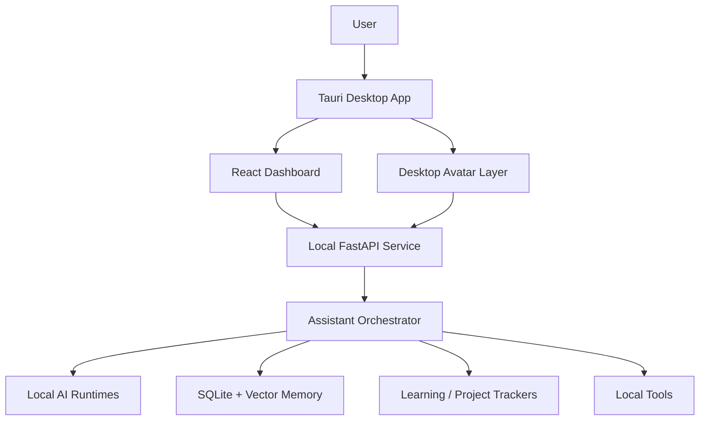
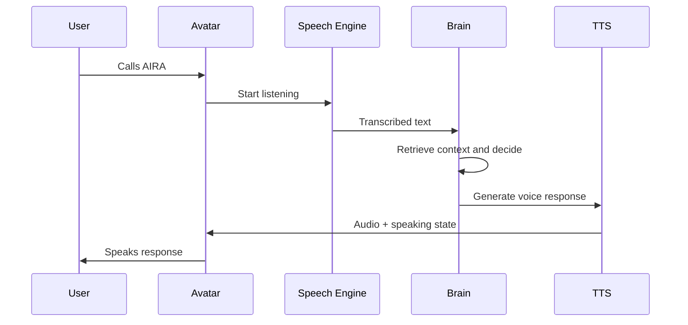

# AIRA Tech Stack Product Requirements Document

Version: 1.0  
Project: AIRA — Local-First Desktop AI Companion  
Document Type: Technical Stack / Architecture PRD  
Target Device: ASUS TUF A15, AMD Ryzen 7 7445HS, 16 GB RAM, RTX 3050 Laptop GPU 4 GB VRAM  
Cost Philosophy: Near-zero rupees after initial laptop ownership  
Status: Vision Lock Candidate

---

## 1. Executive Summary

AIRA is a personal desktop AI companion, not a generic chatbot. The product goal is to build a local-first assistant that can talk with the user, understand basic context, remember work progress, track learning and placement preparation, analyze course activity, maintain a dashboard, and appear as a living desktop avatar when summoned.

This Tech Stack PRD defines the realistic, buildable technical foundation for AIRA under strict constraints:

- Main backend must be free or open-source.
- The app should run on the user’s current laptop.
- Expensive cloud AI APIs must not be required for normal use.
- Continuous screen vision is intentionally excluded.
- Advanced human emotion recognition is intentionally excluded.
- Many AI models running together is intentionally excluded.
- The assistant should feel alive through strong UX, memory, voice, and avatar behavior, not through heavy always-on compute.

The recommended stack is:

- Desktop shell: Tauri
- Frontend: React + TypeScript + Vite
- Styling: Tailwind CSS + custom design tokens
- Local backend: Python FastAPI service
- Local database: SQLite
- Vector memory: SQLite VSS, sqlite-vec, Chroma, or Qdrant local
- Local LLM runtime: Ollama or llama.cpp
- Local LLM models: Phi-3.5 Mini, Qwen2.5 3B/7B quantized, Llama 3.2 3B, Gemma 2 2B/9B quantized
- Speech-to-text: whisper.cpp or faster-whisper
- Text-to-speech: Piper TTS
- Wake word: openWakeWord
- Screen capture: on-demand OS screenshot APIs
- Camera: on-demand OpenCV / MediaPipe
- Browser learning tracker: browser extension + local API
- Dashboard charts: Recharts or ECharts
- Avatar: Live2D Cubism, Rive, Spine, or sprite-based fallback
- Packaging: Tauri build pipeline

The best full-build version achievable at nearly zero rupees is a strong personal study/work companion with local voice, memory, project tracking, dashboard analytics, on-demand screen understanding, and a lightweight desktop avatar. It will not be equal to Jarvis from movies, but it can feel surprisingly personal if the product design is disciplined.

---

## 2. Product Context

### 2.1 What AIRA Must Feel Like

AIRA should feel like a calm, intelligent female digital buddy living on the desktop. She should not feel like a browser chatbot pasted into an app. The experience should be:

- Personal
- Present
- Respectful
- Useful
- Private
- Lightweight
- Emotionally aware at a basic contextual level
- Visually alive without wasting hardware resources

The core feeling:

> “I can call her, she appears, understands what I am doing, remembers where I left off, helps me continue, tracks my learning, and speaks back like a companion.”

### 2.2 Technical Reality

The laptop is capable enough for a serious MVP, but not for unlimited local AI.

Hardware implications:

| Area | Realistic Capability |
| --- | --- |
| Local text reasoning | Good with small/medium quantized models |
| Local voice input | Good |
| Local voice output | Good |
| Dashboard and analytics | Excellent |
| Avatar animation | Good if lightweight |
| On-demand screenshot understanding | Possible, but should be optimized |
| Continuous screen vision | Excluded |
| Heavy multi-model orchestration | Excluded |
| Long autonomous coding/research | Limited locally |
| Advanced emotion recognition | Excluded |

### 2.3 Cost Reality

Near-zero rupees is possible if AIRA uses:

- open-source local models;
- local database;
- local voice models;
- local analytics;
- local file storage;
- local dashboard;
- optional internet search only through free/public methods where legal and stable.

Near-zero rupees is not realistic if AIRA depends on:

- GPT-4/5-level paid APIs for every response;
- ElevenLabs-style paid TTS for all voice;
- cloud vector databases;
- paid hosted backends;
- commercial Live2D assets;
- paid speech recognition APIs;
- paid productivity APIs.

The architecture must treat paid cloud AI as optional, not required.

---

## 3. Technical Product Goals

### 3.1 Primary Goals

1. Build a desktop assistant that works locally by default.
2. Support text chat, voice chat, and voice commands.
3. Maintain long-term memory about projects, learning, goals, notes, and user preferences.
4. Track learning progress from videos, notes, tasks, and roadmap milestones.
5. Provide a full dashboard for projects, placement preparation, learning analytics, and assistant memory.
6. Provide a desktop avatar that appears when summoned and reacts emotionally through animations.
7. Allow AIRA to inspect the current screen only when the user asks.
8. Keep compute usage low while idle.
9. Avoid high recurring cost.
10. Keep architecture modular so individual models or components can be swapped later.

### 3.2 Secondary Goals

1. Support plugin-like skills in the future.
2. Support offline-first behavior.
3. Support optional cloud model fallback.
4. Support multiple personality presets later.
5. Support future mobile companion sync later.
6. Support future external app integrations.

### 3.3 Non-Goals

AIRA v1 does not aim to:

- see the screen continuously;
- read webcam continuously;
- replace a professional coding agent;
- provide medical or mental-health diagnosis;
- run multiple large AI models at the same time;
- guarantee perfect emotional understanding;
- control every app on the computer autonomously;
- silently monitor the user;
- become a cloud-first SaaS product.

---

## 4. Architecture Overview

### 4.1 Recommended High-Level Architecture



### 4.2 System Layers

| Layer | Responsibility | Recommended Tech |
| --- | --- | --- |
| Desktop shell | Native app window, tray, permissions, always-on-top avatar | Tauri |
| Frontend UI | Dashboard, chat, settings, analytics | React + TypeScript |
| Visual style | Dark futuristic UI, responsive layout | Tailwind CSS |
| Local service | AI routing, memory, tools, data APIs | Python FastAPI |
| Local database | Projects, tasks, history, learning events | SQLite |
| Vector memory | Semantic search over notes and history | sqlite-vec / Chroma / Qdrant |
| LLM runtime | Local reasoning and chat | Ollama / llama.cpp |
| Speech input | Voice commands and dictation | whisper.cpp / faster-whisper |
| Speech output | Local female voice | Piper TTS |
| Wake word | “Hey AIRA” style activation | openWakeWord |
| Screen sense | On-demand screenshot capture and OCR | MSS / Tesseract / local VLM optional |
| Camera sense | On-demand camera snapshot | OpenCV |
| Learning tracker | Course/video progress analytics | Browser extension + local API |
| Avatar engine | Living desktop companion | Live2D / Rive / sprite fallback |

---

## 5. Core Technology Decisions

### 5.1 Desktop Framework

#### Recommended: Tauri

Tauri should be used instead of Electron.

Reasons:

- Lower RAM usage.
- Smaller app size.
- Better fit for a laptop with 16 GB RAM.
- Allows native OS APIs through Rust commands.
- Works well with React frontend.
- Good for tray apps, transparent windows, always-on-top overlays, and desktop utilities.

Electron is easier for beginners, but heavier. Since AIRA must run beside study, browser, IDE, and video apps, Tauri is the better long-term choice.

#### Requirement

The desktop app must support:

- main dashboard window;
- floating avatar window;
- system tray icon;
- global hotkey;
- auto-start option;
- microphone permission;
- screen capture permission;
- camera permission;
- local backend process management;
- transparent background for avatar mode;
- always-on-top avatar mode;
- reduced motion / low performance mode.

### 5.2 Frontend Framework

#### Recommended: React + TypeScript + Vite

Reasons:

- Fast development.
- Strong ecosystem.
- Easy dashboard building.
- Good support for charts, animation, state management, and component libraries.
- Easy integration with Tauri.

#### Frontend Libraries

| Need | Recommended Library |
| --- | --- |
| App framework | React |
| Language | TypeScript |
| Build tool | Vite |
| Styling | Tailwind CSS |
| UI primitives | Radix UI |
| Icons | Lucide React |
| Charts | Recharts or Apache ECharts |
| State | Zustand |
| Server state | TanStack Query |
| Forms | React Hook Form |
| Validation | Zod |
| Animation | Framer Motion |
| Command palette | cmdk |
| Markdown rendering | react-markdown |
| Code blocks | Shiki or highlight.js |

### 5.3 Backend Framework

#### Recommended: Python FastAPI

Reasons:

- Python has the best ecosystem for AI, speech, embeddings, OCR, automation, and local models.
- FastAPI is clean and fast enough for local APIs.
- Easy WebSocket support for live chat and voice status.
- Works well as a local service controlled by Tauri.

#### Backend Responsibilities

The backend must handle:

- chat orchestration;
- local model calls;
- memory write/read;
- vector search;
- task/project APIs;
- learning analytics APIs;
- voice pipeline;
- screen capture pipeline;
- camera snapshot pipeline;
- tool execution;
- settings;
- privacy controls;
- local logs;
- model configuration;
- plugin/skill registry in future.

### 5.4 Local Database

#### Recommended: SQLite

SQLite is enough for v1 and probably v2.

Reasons:

- Free.
- Local.
- Simple.
- Reliable.
- No server setup.
- Perfect for personal assistant data.
- Easy backup.

#### Recommended ORM

Use SQLModel or SQLAlchemy.

SQLModel is easier for a small project because it combines Pydantic and SQLAlchemy patterns.

#### Database Files

Suggested local app data structure:

```text
AIRA/
  data/
    aira.sqlite
    memory.sqlite
    vector_index/
    logs/
    exports/
    models/
    voices/
```

Actual installed path should use OS app-data directories, not the project folder.

On Windows:

```text
%APPDATA%/AIRA/
```

or:

```text
%LOCALAPPDATA%/AIRA/
```

---

## 6. AI Brain Stack

### 6.1 Brain Architecture

AIRA’s “brain” should not be a single model. It should be an orchestrator that decides what to do.

Core brain modules:

| Module | Purpose |
| --- | --- |
| Intent Router | Understand if the user is chatting, commanding, asking, planning, or requesting screen help |
| Conversation Manager | Maintains short-term context |
| Memory Manager | Reads/writes long-term memory |
| Tool Planner | Chooses safe local tools |
| Response Generator | Produces final user-facing answer |
| Personality Layer | Applies AIRA’s tone and companion behavior |
| Privacy Guard | Ensures screen/camera access is user-triggered |
| Analytics Engine | Converts raw learning/project data into insights |
| Avatar State Controller | Converts assistant state into animations |

### 6.2 Local LLM Runtime

#### Option A: Ollama

Best for early development.

Pros:

- Simple setup.
- Easy model switching.
- Good local API.
- Large model library.
- Works on Windows.
- Beginner-friendly.

Cons:

- Less fine-grained control than llama.cpp.
- Can consume more RAM depending on model.

#### Option B: llama.cpp

Best for optimized advanced builds.

Pros:

- Highly efficient.
- Great for quantized GGUF models.
- More control.
- Can run CPU/GPU mixed.

Cons:

- More setup complexity.
- Less beginner-friendly.

#### Recommended Path

Use Ollama for MVP. Support llama.cpp later as an advanced runtime option.

### 6.3 Recommended Local Models

The RTX 3050 laptop GPU has 4 GB VRAM. This means AIRA should use small or quantized models.

| Model | Use Case | Expected Fit |
| --- | --- | --- |
| Llama 3.2 3B Instruct | General chat, simple reasoning | Good |
| Phi-3.5 Mini Instruct | Fast assistant responses | Good |
| Qwen2.5 3B Instruct | Balanced reasoning | Good |
| Qwen2.5 7B Q4 | Better reasoning, slower | Possible |
| Gemma 2 2B | Lightweight fallback | Good |
| Mistral 7B Q4 | Stronger but heavier | Possible with limits |

Recommended v1 default:

```text
Primary local model: Qwen2.5 3B Instruct or Llama 3.2 3B
Stronger optional model: Qwen2.5 7B Q4_K_M
Fast fallback: Phi-3.5 Mini or Gemma 2 2B
```

### 6.4 Model Usage Policy

AIRA must avoid running too many AI models simultaneously.

Default runtime behavior:

- Load one main LLM at a time.
- Run speech-to-text only during voice capture.
- Run TTS only during speaking.
- Run embedding model only when memory search/write is needed.
- Run OCR only after user requests screen understanding.
- Run vision model only on demand and only if enabled.

This keeps AIRA responsive on 16 GB RAM and 4 GB VRAM.

### 6.5 Optional Cloud Fallback

Cloud fallback may exist, but must be disabled by default.

Use cases:

- difficult reasoning;
- long coding help;
- deep research;
- complex planning;
- better screen interpretation;
- fallback when local model fails.

Requirement:

- The app must clearly show when cloud mode is used.
- The app must not send screen, camera, notes, or private project data to cloud without explicit user permission.
- The app must allow “local-only mode.”

---

## 7. Memory Stack

### 7.1 Memory Types

AIRA needs multiple memory types, not one giant chat history.

| Memory Type | Example | Storage |
| --- | --- | --- |
| Profile memory | Name, preferences, tone, goals | SQLite |
| Project memory | Current project status and last checkpoint | SQLite + vector |
| Learning memory | Courses, videos, notes, roadmap progress | SQLite |
| Conversation memory | Recent chats and summaries | SQLite |
| Semantic memory | Searchable notes, summaries, decisions | Vector DB |
| System memory | Settings, model preferences, permissions | SQLite |
| Avatar memory | Preferred avatar style, mood behavior | SQLite |

### 7.2 Memory Write Rules

AIRA should not store everything blindly.

Memory should be written when:

- the user explicitly says to remember something;
- a project checkpoint is created;
- a learning session ends;
- a roadmap milestone is completed;
- the user changes a preference;
- a dashboard event is recorded;
- AIRA summarizes a session.

Memory should not be written when:

- the conversation is casual and not important;
- the user shares sensitive data without asking to save it;
- the information is temporary;
- the model is uncertain.

### 7.3 Memory Retrieval Rules

Before answering, AIRA should retrieve memory only when useful.

Retrieve memory for:

- “Where did I leave off?”
- “Continue my project.”
- “What should I study today?”
- “How much course have I completed?”
- “What was my roadmap?”
- “What did I decide last time?”
- “Remind me what I was building.”

Do not retrieve memory for:

- basic general questions;
- simple commands;
- quick chat;
- pure UI actions.

### 7.4 Vector Database Choice

Recommended options:

| Option | Pros | Cons | Recommendation |
| --- | --- | --- | --- |
| sqlite-vec | Simple, local, same DB family | Newer ecosystem | Best future direction |
| SQLite VSS | SQLite-native vector search | Setup can be tricky | Good if stable |
| Chroma local | Easy AI memory store | More dependencies | Good MVP option |
| Qdrant local | Strong vector DB | Extra service complexity | Good later |

Recommended MVP:

```text
SQLite for structured memory
Chroma local or sqlite-vec for semantic memory
```

Recommended later:

```text
Move semantic search fully into sqlite-vec if stable enough
```

### 7.5 Embedding Models

Recommended local embedding models:

| Model | Notes |
| --- | --- |
| bge-small-en-v1.5 | Lightweight and good |
| all-MiniLM-L6-v2 | Very lightweight |
| nomic-embed-text | Good with Ollama |

Recommended:

```text
nomic-embed-text through Ollama for simplicity
or bge-small-en-v1.5 through sentence-transformers
```

---

## 8. Voice Stack

### 8.1 Voice Input

Recommended:

- whisper.cpp for efficient local transcription;
- faster-whisper as an alternative if GPU/CPU setup works well.

Model options:

| Model | Use Case |
| --- | --- |
| Whisper tiny | Fast commands |
| Whisper base | Better balance |
| Whisper small | Better accuracy but heavier |

Recommended default:

```text
Whisper base for normal voice
Whisper tiny for low-power mode
```

### 8.2 Voice Output

Recommended:

- Piper TTS for local, free speech.

Reasons:

- Offline.
- Free.
- Fast.
- Low resource usage.
- Good enough for assistant voice.

Limitations:

- Not as natural as premium paid voices.
- Emotion in voice will be limited.
- Female voice quality depends on available voice model.

### 8.3 Wake Word

Recommended:

- openWakeWord

Wake phrases:

- “Hey AIRA”
- “AIRA”
- “Wake up AIRA”

MVP can start without wake word:

- Push-to-talk hotkey.
- Tray button.
- Avatar click.
- Keyboard shortcut.

Recommended build order:

1. Push-to-talk.
2. Global hotkey.
3. Wake word.

### 8.4 Voice Conversation Flow



### 8.5 Voice Requirements

Voice system must support:

- push-to-talk;
- stop speaking;
- interrupt while speaking;
- mute mode;
- voice input timeout;
- transcript preview;
- “I didn’t catch that” fallback;
- offline operation;
- selected female voice profile;
- low-latency short responses.

---

## 9. Screen and Camera Sense Stack

### 9.1 Screen Sense Policy

AIRA must not watch the screen continuously.

Screen access happens only when:

- user says “look at my screen”;
- user clicks screen peek;
- user asks “what is this?”;
- user asks for help with visible error;
- user explicitly enables a temporary session.

The UI must show a visible privacy indicator during screen capture.

### 9.2 Screen Capture

Recommended:

- Tauri native screen capture commands;
- Windows Graphics Capture API where possible;
- Python MSS fallback;
- screenshot saved temporarily in app cache;
- auto-delete after analysis unless user saves it.

### 9.3 OCR

Recommended:

- Tesseract OCR for free local OCR;
- EasyOCR as an alternative but heavier;
- Windows OCR optional if accessible.

Use OCR for:

- reading error messages;
- reading course titles;
- reading code snippets;
- identifying visible text;
- extracting page headings.

### 9.4 Visual Question Answering

Because local VLMs can be heavy on 4 GB VRAM, v1 should use a staged approach.

Stage 1:

- screenshot;
- OCR;
- UI element heuristics;
- local LLM reasoning over extracted text;
- user confirms missing details.

Stage 2:

- optional lightweight local VLM if performance allows.

Possible local VLMs:

| Model | Notes |
| --- | --- |
| Moondream | Lightweight visual understanding |
| Florence-2 | Useful for image tasks, setup varies |
| LLaVA 1.5 7B quantized | Heavier; may be slow |

Recommendation:

```text
Do not make VLM required in v1.
Use OCR-first screen understanding.
Add optional Moondream-style vision later.
```

### 9.5 Camera Sense

Camera is optional and on-demand.

Use cases:

- user asks “can you see me?”;
- simple presence detection;
- rough expression estimation if enabled;
- avatar responds to user presence.

Recommended tech:

- OpenCV for camera access;
- MediaPipe Face Detection for basic face presence;
- no continuous emotion analysis in v1.

Privacy:

- camera indicator must be visible;
- no recording by default;
- no face data saved by default;
- camera off by default.

---

## 10. Avatar Stack

### 10.1 Avatar Implementation Options

| Option | Quality | Complexity | Cost | Recommendation |
| --- | --- | --- | --- | --- |
| Sprite-based 2D avatar | Medium | Low | Free | Best MVP |
| Rive avatar | High | Medium | Free tier/tools vary | Great if designer-friendly |
| Live2D avatar | Very high | High | Can be free but asset creation hard | Best final vision |
| 3D VRM avatar | High | Medium-high | Free options | Possible later |

Recommended path:

```text
MVP: Sprite/Rive avatar
V1 polished: Live2D or Rive
Future: optional VRM 3D avatar
```

### 10.2 Avatar Runtime

The avatar should run in a transparent Tauri window.

Required behavior:

- always-on-top toggle;
- click-through mode toggle;
- dock to screen edge;
- summoned by hotkey/voice;
- shows listening/thinking/speaking states;
- optional small walking/idle movement;
- can open dashboard when asked;
- does not block user work.

### 10.3 Avatar State Events

The backend should emit state events:

```json
{
  "state": "listening",
  "mood": "focused",
  "intensity": 0.7,
  "message": "I'm listening."
}
```

Supported states:

- sleeping;
- idle;
- noticing;
- listening;
- thinking;
- speaking;
- working;
- success;
- warning;
- error;
- privacy;
- focus;
- celebration.

### 10.4 Avatar Performance Budget

Avatar must use:

- low CPU while idle;
- capped animation FPS;
- no heavy GPU usage;
- reduced animation while laptop is under load;
- no constant AI processing.

Recommended:

```text
Idle animation: 15–24 FPS
Active animation: 30 FPS
Low-power mode: 10–15 FPS
```

---

## 11. Dashboard Stack

### 11.1 Dashboard Responsibilities

The dashboard is the command center for:

- today’s mission;
- project continuity;
- placement roadmap;
- course progress;
- learning analytics;
- notes;
- memory;
- assistant settings;
- privacy controls;
- model controls;
- avatar settings.

### 11.2 Frontend Dashboard Modules

Recommended routes:

| Route | Purpose |
| --- | --- |
| Home | Overview and current mission |
| Today | Daily plan and tasks |
| Projects | Active project status and checkpoints |
| Learning | Courses, videos, notes, progress |
| Roadmap | Placement preparation plan |
| Insights | Analytics and recommendations |
| Memory | What AIRA remembers |
| Chat | Conversation history |
| Settings | Models, privacy, voice, avatar |

### 11.3 Charting

Recommended:

- Recharts for MVP;
- Apache ECharts if more advanced charts are needed.

Chart types:

- weekly study time;
- course completion percentage;
- watched vs remaining videos;
- notes completed;
- roadmap progress;
- streaks;
- topic weakness heatmap;
- project velocity;
- task completion rate.

### 11.4 Dashboard Data Refresh

Use:

- REST APIs for normal CRUD;
- WebSocket for live assistant state;
- local event bus for avatar/dashboard sync.

Refresh strategy:

- dashboard analytics every 30–60 seconds while open;
- immediate update after learning/project events;
- no background heavy analytics while dashboard is closed.

---

## 12. Learning and Placement Tracker Stack

### 12.1 Course Tracking

AIRA should track:

- course name;
- platform;
- video count;
- watched videos;
- watched duration;
- total duration;
- notes written;
- topics completed;
- current video;
- last watched timestamp;
- quiz/test scores if entered;
- confidence per topic.

### 12.2 Video Progress Collection

Possible sources:

| Source | Method | Difficulty |
| --- | --- | --- |
| Manual entry | User marks progress | Easy |
| Local video files | Media player tracking | Medium |
| YouTube | Browser extension reads watch progress | Medium |
| Udemy/Coursera/etc. | Browser extension DOM tracking | Harder |

Recommended MVP:

```text
Manual course tracker + optional YouTube browser extension
```

### 12.3 Browser Extension

For tracking videos, use a browser extension.

Recommended tech:

- TypeScript;
- Manifest V3;
- content scripts;
- background service worker;
- local API calls to AIRA backend;
- no cloud upload.

Browser extension responsibilities:

- detect video page;
- read video title;
- read duration;
- read current timestamp;
- detect pause/play/end;
- send learning events to local FastAPI service;
- allow user to map video to course.

### 12.4 Placement Roadmap Engine

The roadmap engine should track:

- DSA;
- aptitude;
- core CS;
- projects;
- resume;
- mock interviews;
- coding practice;
- company preparation;
- revision.

Data model:

- roadmap;
- phase;
- topic;
- task;
- resource;
- deadline;
- completion state;
- confidence rating;
- revision count.

### 12.5 Analytics Engine

Analytics should calculate:

- completion percentage;
- remaining videos;
- estimated completion date;
- daily study average;
- weekly consistency;
- weak topics;
- skipped topics;
- overdue tasks;
- most active study time;
- project momentum;
- next best task.

Recommendation logic should be simple and explainable in v1.

Example:

> “You watched 42% of the DSA course. At your current 4.5 videos/day pace, you can finish in 13 days. Today, continue Stack problems before starting Trees.”

---

## 13. Project Continuity Stack

### 13.1 Project Memory

AIRA must support “where I left off.”

For every project:

- title;
- description;
- tech stack;
- current status;
- active task;
- last checkpoint;
- next recommended step;
- blockers;
- files/links;
- decisions;
- timeline;
- notes;
- related conversations.

### 13.2 Checkpoint System

Checkpoint is a central feature.

User commands:

- “Save checkpoint.”
- “Where did I leave off?”
- “Continue from last time.”
- “Summarize today’s progress.”
- “What should I do next?”

Checkpoint content:

- what was done;
- what remains;
- current files/resources;
- last problem;
- next action;
- confidence;
- timestamp.

### 13.3 File and Folder Awareness

For v1, AIRA should not freely scan the whole computer.

The user should add project folders manually.

Allowed project folder behavior:

- index filenames;
- index selected notes;
- summarize README files;
- detect recent modified files;
- link checkpoints to files.

Avoid:

- scanning entire drives;
- reading secrets;
- indexing private folders without permission;
- automatically uploading file content.

---

## 14. Automation and Local Tools Stack

### 14.1 Local Tool Execution

AIRA can have “hands,” but they must be safe.

MVP tools:

- open app;
- open folder;
- open URL;
- create note;
- create task;
- start timer;
- take screenshot;
- summarize selected note;
- add course progress;
- save checkpoint.

Later tools:

- create project files;
- run local commands with confirmation;
- organize notes;
- generate flashcards;
- create resume draft;
- export report;

### 14.2 Tool Permission Levels

| Level | Examples | Confirmation |
| --- | --- | --- |
| Safe read | read AIRA database, show dashboard | No |
| Safe local action | start timer, open dashboard | No |
| User data write | create note, mark task done | Maybe |
| External action | send email, push GitHub | Yes |
| Shell command | run script, install package | Yes |
| Destructive action | delete files | Always yes |

### 14.3 Tool Registry

Tool definitions should include:

- name;
- description;
- input schema;
- permission level;
- confirmation requirement;
- handler;
- success message;
- error message;
- avatar state mapping.

Example:

```json
{
  "name": "save_project_checkpoint",
  "permission": "user_data_write",
  "requires_confirmation": false,
  "description": "Save a project progress checkpoint."
}
```

---

## 15. API Design

### 15.1 Local API

FastAPI should expose local endpoints under:

```text
http://127.0.0.1:<port>/api
```

The backend must bind to localhost only by default.

### 15.2 Core Endpoints

| Endpoint | Method | Purpose |
| --- | --- | --- |
| `/api/health` | GET | Backend status |
| `/api/chat` | POST | Text chat |
| `/api/voice/transcribe` | POST | Voice transcription |
| `/api/voice/speak` | POST | TTS generation |
| `/api/memory/search` | POST | Memory retrieval |
| `/api/memory` | POST | Save memory |
| `/api/projects` | GET/POST | Project CRUD |
| `/api/projects/{id}/checkpoint` | POST | Save checkpoint |
| `/api/learning/courses` | GET/POST | Course CRUD |
| `/api/learning/events` | POST | Track learning event |
| `/api/analytics/summary` | GET | Dashboard analytics |
| `/api/screen/analyze` | POST | On-demand screen analysis |
| `/api/avatar/state` | GET | Current avatar state |
| `/api/settings` | GET/PATCH | Settings |

### 15.3 WebSocket Channels

| Channel | Purpose |
| --- | --- |
| `/ws/assistant` | chat streaming and assistant status |
| `/ws/avatar` | avatar animation state |
| `/ws/voice` | live voice status |
| `/ws/dashboard` | live analytics updates |

### 15.4 API Requirements

The local API must:

- require local-only access by default;
- not expose itself to the network unless user enables it;
- validate inputs with Pydantic;
- log errors safely;
- avoid logging sensitive screenshots or voice by default;
- support streaming responses;
- support cancellation.

---

## 16. Data Model PRD

### 16.1 Core Tables

Recommended SQLite tables:

```text
users
settings
conversations
messages
memories
memory_embeddings
projects
project_checkpoints
project_files
tasks
courses
course_modules
course_videos
learning_events
notes
roadmaps
roadmap_phases
roadmap_topics
roadmap_tasks
analytics_snapshots
avatar_events
tool_runs
privacy_events
```

### 16.2 Important Entities

#### Project

Fields:

- id;
- name;
- description;
- status;
- priority;
- tech_stack;
- current_focus;
- next_step;
- created_at;
- updated_at.

#### Project Checkpoint

Fields:

- id;
- project_id;
- summary;
- completed_work;
- current_problem;
- next_action;
- linked_files;
- confidence;
- created_at.

#### Course

Fields:

- id;
- title;
- platform;
- total_videos;
- completed_videos;
- total_duration_seconds;
- watched_duration_seconds;
- notes_count;
- status;
- target_completion_date;
- created_at;
- updated_at.

#### Learning Event

Fields:

- id;
- course_id;
- video_id;
- event_type;
- watched_seconds;
- source;
- metadata_json;
- created_at.

#### Memory

Fields:

- id;
- memory_type;
- title;
- content;
- importance;
- source;
- related_entity_type;
- related_entity_id;
- created_at;
- updated_at.

---

## 17. Local Model Performance Strategy

### 17.1 Performance Modes

AIRA should support three modes.

| Mode | Behavior |
| --- | --- |
| Eco | Small model, low animation, no wake word |
| Balanced | Default model, normal animation, voice enabled |
| Focus | Better model, stronger reasoning, more CPU/GPU |

### 17.2 Recommended Defaults for User Laptop

```text
Default mode: Balanced
Main model: 3B instruct model
TTS: Piper
STT: Whisper base
Embeddings: small local embedding model
Vision: OCR-first, on-demand only
Avatar: 24 FPS idle, 30 FPS active
```

### 17.3 Resource Budgets

| Component | Idle Target | Active Target |
| --- | --- | --- |
| Desktop UI | < 300 MB RAM | < 700 MB RAM |
| Backend | < 300 MB RAM | < 1.5 GB RAM |
| LLM | unloaded or light | 3–8 GB system RAM depending model |
| Avatar | low CPU | moderate GPU/CPU |
| STT | off | temporary CPU/GPU use |
| TTS | off | temporary CPU use |

### 17.4 Startup Strategy

Do not load everything at startup.

Startup sequence:

1. Launch Tauri shell.
2. Start local FastAPI backend.
3. Load settings and avatar state.
4. Show avatar in sleeping/idle mode.
5. Load LLM only after first chat or when preload is enabled.
6. Load STT only when voice is activated.

This makes the app feel lightweight.

---

## 18. Security and Privacy Stack

### 18.1 Privacy Principles

AIRA is personal. Trust is part of the product.

Rules:

- local-first by default;
- no silent screen watching;
- no silent camera watching;
- no cloud upload without explicit permission;
- no full disk scanning by default;
- clear privacy indicators;
- easy memory delete;
- easy export;
- easy local-only mode.

### 18.2 Local Security

Recommended:

- bind backend to `127.0.0.1`;
- random local API token generated on install;
- store token in OS app config;
- require token from frontend/extension;
- CORS only for local app and approved browser extension;
- no open LAN access by default.

### 18.3 Sensitive Data Handling

Do not store by default:

- raw screenshots;
- raw voice recordings;
- raw camera images;
- passwords;
- API keys;
- private keys;
- face data.

If stored, require explicit user setting.

### 18.4 Memory Control UI

Memory screen must allow:

- view memories;
- edit memories;
- delete memories;
- disable memory;
- export memory;
- clear conversation history;
- clear learning data;
- clear project data.

---

## 19. Development Stack

### 19.1 Languages

| Area | Language |
| --- | --- |
| Desktop shell | Rust via Tauri |
| Frontend | TypeScript |
| Backend | Python |
| Browser extension | TypeScript |
| Scripts | Python |
| Data queries | SQL |

### 19.2 Repo Structure

Recommended monorepo:

```text
aira/
  apps/
    desktop/
      src-tauri/
      src/
    backend/
      app/
      tests/
    extension/
      src/
  packages/
    shared-types/
    design-system/
  models/
    README.md
  docs/
    prd/
    architecture/
    api/
  scripts/
  .env.example
  README.md
```

### 19.3 Backend Structure

```text
backend/
  app/
    main.py
    config.py
    database.py
    api/
      chat.py
      memory.py
      projects.py
      learning.py
      analytics.py
      voice.py
      screen.py
      avatar.py
      settings.py
    services/
      assistant_orchestrator.py
      model_runtime.py
      memory_service.py
      vector_service.py
      speech_service.py
      tts_service.py
      screen_service.py
      analytics_service.py
      avatar_service.py
      tool_service.py
    models/
      db_models.py
      schemas.py
    tools/
    tests/
```

### 19.4 Frontend Structure

```text
desktop/src/
  app/
  components/
  routes/
  features/
    chat/
    avatar/
    dashboard/
    projects/
    learning/
    roadmap/
    memory/
    settings/
  lib/
    api.ts
    ws.ts
    store.ts
  styles/
```

---

## 20. Build and Packaging

### 20.1 Local Development

Development commands should be simple:

```text
pnpm dev
pnpm desktop:dev
pnpm backend:dev
pnpm extension:dev
```

### 20.2 Package Managers

Recommended:

- pnpm for JavaScript/TypeScript workspace;
- uv or Poetry for Python dependencies;
- Cargo for Tauri/Rust.

Recommended choice:

```text
pnpm + uv + Cargo
```

### 20.3 Windows Packaging

Tauri should build:

- `.msi` installer;
- `.exe` installer if needed;
- portable build later.

Installer should:

- install desktop app;
- create app-data folder;
- optionally configure auto-start;
- check for local model runtime;
- guide user to install models.

### 20.4 Model Distribution

Do not bundle huge models inside the app installer.

Instead:

- app includes model manager screen;
- user downloads selected models;
- models stored in local model directory;
- app checks if model exists;
- app offers recommended model list.

---

## 21. Model Manager Requirements

The app needs a model manager because local AI setup can confuse users.

Model manager should show:

- installed models;
- recommended models;
- model size;
- expected speed;
- quality level;
- RAM/VRAM warning;
- download status;
- active model;
- delete model button.

Example model labels:

| Label | Meaning |
| --- | --- |
| Fast | quickest responses, weaker reasoning |
| Balanced | recommended default |
| Strong | better answers, slower |
| Experimental | may be unstable |

For the user’s laptop, show:

```text
Recommended: 3B–4B quantized model
Optional strong: 7B Q4 model
Avoid: 13B+ models
```

---

## 22. Testing Strategy

### 22.1 Unit Tests

Test:

- memory scoring;
- analytics calculations;
- project checkpoint creation;
- course progress math;
- intent routing;
- settings validation;
- tool permission logic.

Recommended:

- pytest for backend;
- Vitest for frontend;
- Playwright for UI flows.

### 22.2 Integration Tests

Test:

- chat request to local model;
- memory retrieval during “where did I leave off?”;
- course progress event from extension to backend;
- avatar state change after voice command;
- screen analysis permission flow;
- TTS response generation.

### 22.3 Performance Tests

Measure:

- app startup time;
- first response latency;
- voice transcription latency;
- TTS generation latency;
- dashboard load time;
- memory search latency;
- idle CPU;
- idle RAM;
- active RAM.

### 22.4 Manual QA Scenarios

Must pass:

- user launches app;
- avatar appears idle;
- user opens dashboard;
- user chats with AIRA;
- user speaks to AIRA;
- AIRA saves a project checkpoint;
- AIRA answers where user left off;
- user tracks course progress;
- dashboard updates analytics;
- user asks “what is this?” and approves screen capture;
- AIRA explains visible text/error;
- user turns off memory;
- user deletes a saved memory.

---

## 23. MVP Build Plan

### 23.1 Phase 0 — Foundation

Deliver:

- Tauri app;
- React dashboard shell;
- FastAPI backend;
- SQLite setup;
- local settings;
- basic chat UI;
- Ollama integration;
- simple avatar placeholder.

Success:

- user can chat with local model inside desktop app.

### 23.2 Phase 1 — Memory and Projects

Deliver:

- project CRUD;
- checkpoint system;
- memory save/search;
- “where did I leave off?”;
- memory management UI.

Success:

- AIRA can remember project status and continue later.

### 23.3 Phase 2 — Voice

Deliver:

- push-to-talk;
- Whisper transcription;
- Piper TTS;
- interrupt speaking;
- voice settings.

Success:

- user can talk to AIRA and hear spoken replies.

### 23.4 Phase 3 — Learning Dashboard

Deliver:

- course tracker;
- notes tracker;
- roadmap tracker;
- analytics dashboard;
- daily mission recommendations.

Success:

- user can track placement preparation and course progress.

### 23.5 Phase 4 — Desktop Avatar

Deliver:

- transparent avatar window;
- always-on-top mode;
- summon/hide behavior;
- emotion states;
- speaking/listening/thinking animations;
- quick action panel.

Success:

- AIRA feels like she lives on the desktop.

### 23.6 Phase 5 — Screen Sense

Deliver:

- on-demand screenshot capture;
- OCR;
- screen explanation flow;
- privacy indicator;
- temporary image deletion.

Success:

- user can ask “what is this?” and AIRA can explain visible text/errors.

### 23.7 Phase 6 — Browser Extension

Deliver:

- YouTube video progress tracking;
- local API bridge;
- course mapping;
- dashboard update.

Success:

- AIRA can track watched course videos automatically for supported sites.

---

## 24. Recommended First Implementation Stack

For the actual first coding sprint, use this exact stack:

```text
Desktop:
  Tauri + React + TypeScript + Vite

UI:
  Tailwind CSS + Radix UI + Lucide + Recharts + Zustand

Backend:
  Python + FastAPI + SQLModel + SQLite

AI:
  Ollama
  Qwen2.5 3B or Llama 3.2 3B
  nomic-embed-text

Voice:
  whisper.cpp or faster-whisper
  Piper TTS

Screen:
  Tauri screenshot command or Python MSS
  Tesseract OCR

Avatar:
  Sprite/Rive first
  Live2D later

Extension:
  TypeScript Manifest V3

Testing:
  pytest + Vitest + Playwright

Packaging:
  Tauri Windows installer
```

This stack is the best balance of:

- free;
- realistic;
- powerful enough;
- laptop-friendly;
- scalable;
- beginner-buildable;
- compatible with the locked product vision.

---

## 25. Main Technical Risks

### 25.1 Local Model Quality

Risk:

Small local models may give weaker answers than paid frontier models.

Mitigation:

- use structured prompts;
- use memory retrieval;
- keep tasks focused;
- allow optional cloud fallback;
- use stronger 7B model only when needed.

### 25.2 Voice Latency

Risk:

Voice conversation may feel slow.

Mitigation:

- use push-to-talk first;
- keep responses short;
- stream text before TTS completes;
- use smaller Whisper model for commands;
- cache common TTS phrases.

### 25.3 Avatar Complexity

Risk:

Live2D-quality avatar is time-consuming.

Mitigation:

- start with sprite/Rive avatar;
- build state system first;
- upgrade art engine later.

### 25.4 Course Tracking Reliability

Risk:

Websites change DOM structure and break tracking.

Mitigation:

- start with manual tracker;
- support YouTube first;
- make browser extension modular;
- allow quick manual correction.

### 25.5 Screen Understanding Accuracy

Risk:

OCR-only screen understanding may miss visual context.

Mitigation:

- ask follow-up questions;
- use OCR plus screenshot metadata;
- allow user to crop/select region;
- add optional VLM later.

### 25.6 Resource Usage

Risk:

App becomes heavy if too many components run.

Mitigation:

- lazy-load models;
- unload inactive models;
- use performance modes;
- no continuous vision;
- no many-model runtime;
- cap avatar animation.

---

## 26. Cost Breakdown

### 26.1 Free Stack Components

| Component | Cost |
| --- | --- |
| Tauri | Free |
| React | Free |
| FastAPI | Free |
| SQLite | Free |
| Ollama | Free |
| llama.cpp | Free |
| Open-source LLMs | Free |
| Whisper.cpp | Free |
| Piper TTS | Free |
| Tesseract OCR | Free |
| OpenCV | Free |
| Tailwind CSS | Free |
| Recharts | Free |
| Browser extension | Free |

### 26.2 Possible Costs

| Item | Cost Risk |
| --- | --- |
| Paid cloud LLM fallback | Optional |
| Premium TTS voice | Optional |
| Professional avatar art | Optional |
| Paid Live2D assets/tools | Optional |
| Cloud sync | Optional |
| App store publishing | Optional |

### 26.3 Near-Zero Rupees Verdict

The project is possible at near-zero rupees if:

- you accept local model limitations;
- you build the avatar using free/DIY assets first;
- you do not depend on paid voice APIs;
- you do not require frontier-level reasoning;
- you keep vision on-demand;
- you build learning tracking mostly local/manual first.

Best realistic outcome:

> AIRA can become a genuinely useful personal desktop companion for study, projects, planning, dashboard analytics, voice interaction, and on-demand screen help — but not a movie-level autonomous AI.

---

## 27. Final Locked Tech Stack Decision

### 27.1 Locked v1 Stack

| Area | Locked Choice |
| --- | --- |
| Desktop app | Tauri |
| Frontend | React + TypeScript + Vite |
| Styling | Tailwind CSS + custom tokens |
| UI primitives | Radix UI |
| State | Zustand + TanStack Query |
| Charts | Recharts |
| Backend | Python FastAPI |
| Database | SQLite |
| ORM | SQLModel |
| Vector memory | Chroma local or sqlite-vec |
| LLM runtime | Ollama first, llama.cpp later |
| Main local model | Qwen2.5 3B / Llama 3.2 3B |
| Strong local model | Qwen2.5 7B Q4 optional |
| Embeddings | nomic-embed-text / bge-small |
| STT | whisper.cpp / faster-whisper |
| TTS | Piper |
| Wake word | openWakeWord later |
| Screen capture | Tauri native / MSS |
| OCR | Tesseract |
| Camera | OpenCV + MediaPipe optional |
| Avatar MVP | Sprite/Rive |
| Avatar final | Live2D/Rive |
| Extension | TypeScript Manifest V3 |
| Packaging | Tauri Windows installer |

### 27.2 Locked Technical Philosophy

AIRA must be:

- local-first;
- modular;
- privacy-respecting;
- low-cost;
- resource-aware;
- emotionally expressive through UX;
- useful before it is fancy;
- extensible after the core loop works.

### 27.3 The Core Loop to Build First

The most important loop:

```text
User calls AIRA
→ AIRA listens or receives text
→ AIRA understands intent
→ AIRA retrieves project/learning memory if needed
→ AIRA answers or performs safe action
→ AIRA updates dashboard/memory
→ Avatar reacts naturally
```

If this loop feels good, the product will feel alive even before advanced features are added.

---

## 28. Definition of Done for Technical v1

AIRA technical v1 is complete when:

- desktop app launches reliably on Windows;
- local backend starts automatically;
- user can chat with local LLM;
- user can talk to AIRA using push-to-talk;
- AIRA can speak back using local TTS;
- AIRA can save and recall project checkpoints;
- AIRA can answer “where did I leave off?”;
- user can track course/video/note progress;
- dashboard shows meaningful analytics;
- avatar appears on desktop when summoned;
- avatar reflects assistant states;
- screen analysis works on demand with privacy indicator;
- memory can be viewed/deleted;
- app works without paid APIs;
- idle resource usage is acceptable;
- settings allow local-only mode.

---

## 29. Suggested Next Technical Deliverables

After this document is locked, create:

1. Database schema document.
2. API specification document.
3. Folder/repo structure document.
4. MVP sprint plan.
5. Model benchmark checklist for the ASUS TUF A15.
6. Avatar technical prototype plan.
7. Browser extension PRD.
8. Privacy and permissions specification.

The recommended next file is:

```text
AIRA_MVP_Implementation_Roadmap_v1.0.md
```

---

## 30. Final Build Recommendation

Build AIRA in this order:

1. Desktop shell.
2. Local backend.
3. Local chat.
4. Memory.
5. Project checkpoints.
6. Dashboard.
7. Voice.
8. Learning tracker.
9. Avatar.
10. Screen sense.
11. Browser extension.
12. Polish.

Do not start with the avatar or advanced AI. Start with the assistant loop and memory. The avatar becomes powerful only when the brain and memory behind it are useful.

This is the practical path to the strongest near-zero-cost AIRA on the current laptop.

